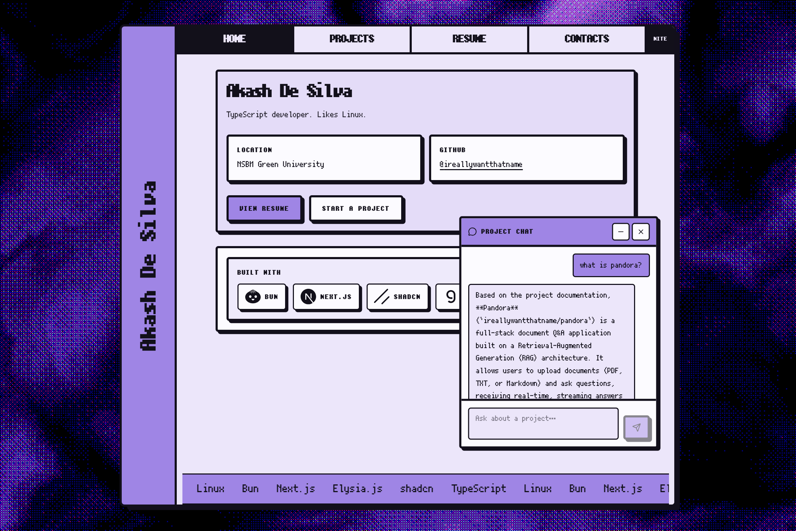

<!-- prettier-ignore -->
<div align="center">


# Akash De Silva

Personal portfolio. TypeScript developer. Likes Linux.

[](https://akashdesilva.space)


[](https://convex.dev)
[](https://developers.cloudflare.com/workers/)

[Overview](#overview) • [Features](#features) • [Getting started](#getting-started) • [Project chat](#project-chat) • [Deploy](#deploy)



</div>

A neo-brutalist personal site with a pixel typeface, dithered WebGL background, and a RAG chat that answers questions from each pinned repo's `CONTEXT.md`. Live at [akashdesilva.space](https://akashdesilva.space).

## Overview

The UI is a Next.js App Router site. GitHub pinned repositories power the projects page. Convex stores chunked embeddings from each repo's `CONTEXT.md`, and a Groq-hosted model answers questions against that index.

Pages:

| Route | What it shows |
| --- | --- |
| `/` | Name, location, GitHub, now playing, resume CTA |
| `/projects` | Pinned repos, Microlink screenshots, project chat |
| `/resume` | Embedded resume document |
| `/contacts` | Map, email, GitHub |

## Features

- **Now playing** from the Spotify Web API (current track, or last played)
- **Pinned projects** from GitHub GraphQL, with homepage screenshots from [Microlink](https://microlink.io)
- **Project chat** that retrieves `CONTEXT.md` chunks and streams answers through Groq (`qwen/qwen3.6-27b`)
- **Webhook reindex** so a push that touches `CONTEXT.md` updates the Convex vector index
- **Light and dark themes** (DAY / NITE) plus a skip-to-content link
- **Cloudflare Workers** hosting via OpenNext

## Getting started

### Prerequisites

- [Bun](https://bun.sh) 1.3+
- A [Convex](https://convex.dev) account
- API keys listed in [Environment](#environment)

### Install and run

```bash
git clone https://github.com/ireallywantthatname/portfolio.git
cd portfolio
bun install
bunx convex dev
```

In another terminal:

```bash
bun run dev
```

Open [http://localhost:3000](http://localhost:3000).

> [!TIP]
> Keep `bunx convex dev` running while you work. It pushes functions, writes `convex/_generated`, and fills `NEXT_PUBLIC_CONVEX_URL` in `.env.local`.

### Environment

Create `.env.local` in the project root:

```bash
NEXT_PUBLIC_CONVEX_URL=
NEXT_PUBLIC_CONVEX_SITE_URL=
GITHUB_TOKEN=
GROQ_API_KEY=
MICROLINK_API_KEY=
SPOTIFY_CLIENT_ID=
SPOTIFY_CLIENT_SECRET=
SPOTIFY_REDIRECT_URI=http://127.0.0.1:3000/api/spotify/callback
SPOTIFY_REFRESH_TOKEN=
```

| Variable | Where | Required | Used for |
| --- | --- | --- | --- |
| `NEXT_PUBLIC_CONVEX_URL` | Next.js | yes | Chat retrieval against Convex |
| `NEXT_PUBLIC_CONVEX_SITE_URL` | Next.js | yes | Convex HTTP actions (webhook URL) |
| `GITHUB_TOKEN` | Next.js and Convex | yes | Pinned repos and `CONTEXT.md` |
| `GROQ_API_KEY` | Next.js | yes | Streaming chat replies |
| `MICROLINK_API_KEY` | Next.js | no | Project screenshots (falls back to the public API) |
| `SPOTIFY_CLIENT_ID` | Next.js | yes for now playing | Spotify app |
| `SPOTIFY_CLIENT_SECRET` | Next.js | yes for now playing | Spotify app |
| `SPOTIFY_REDIRECT_URI` | Next.js | local only | One-time OAuth callback |
| `SPOTIFY_REFRESH_TOKEN` | Next.js | yes for now playing | Server access to your player |
| `GEMINI_API_KEY` | Convex | yes | 768-dim embeddings (`text-embedding-004`) |
| `GITHUB_WEBHOOK_SECRET` | Convex | yes for webhook | HMAC check on GitHub push events |
| `GITHUB_OWNER` | Convex | no | Defaults to `ireallywantthatname` |

Set Convex secrets with `bunx convex env set NAME value`, or in the Convex dashboard.

After the Spotify app exists, mint a refresh token once:

```bash
bun run dev
```

Open [http://127.0.0.1:3000/api/spotify/login](http://127.0.0.1:3000/api/spotify/login), approve `user-read-currently-playing` and `user-read-recently-played`, then copy `SPOTIFY_REFRESH_TOKEN` into `.env.local` and `.env.production` and restart. Login and callback return 404 in production.

## Project chat

Answers come only from indexed `CONTEXT.md` files on pinned repositories. If a repo has no such file, chat has nothing to retrieve for it.

1. Add a `CONTEXT.md` at the root of each pinned repo.
2. Index them:

   ```bash
   bunx convex run rag:bootstrap
   ```

3. Optional: point a GitHub push webhook at `{NEXT_PUBLIC_CONVEX_SITE_URL}/github/webhook` with `GITHUB_WEBHOOK_SECRET`. A push that adds, changes, or removes `CONTEXT.md` reindexes that repo.

> [!NOTE]
> Chat refuses to invent projects, stacks, or links that are not in the retrieved docs. Empty index means empty answers.

## Deploy

The Worker is configured in `wrangler.jsonc` and served on `akashdesilva.space`.

```bash
bunx convex deploy
bun run deploy
```

`bun run preview` builds with OpenNext and runs a local Cloudflare preview.

Production Next.js secrets live in `.env.production` (gitignored) and are picked up by the OpenNext / Wrangler build. Convex production env vars are separate and must be set on the Convex deployment.

## Stack

- [Next.js](https://nextjs.org) 16, React 19, Tailwind CSS 4
- [Bun](https://bun.sh)
- [shadcn/ui](https://ui.shadcn.com) (`base-nova`)
- [Convex](https://docs.convex.dev) (vector search, HTTP webhook)
- [Groq](https://groq.com) for chat, [Gemini](https://ai.google.dev) for embeddings
- [OpenNext](https://opennext.js.org/cloudflare) on Cloudflare Workers
